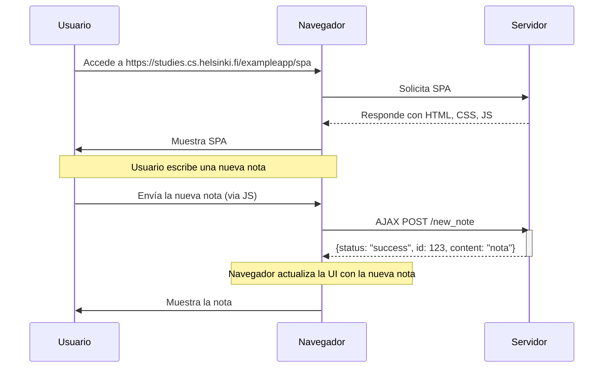

```mermaid
sequenceDiagram
    participant Usuario as Usuario
    participant Navegador as Navegador
    participant Servidor as Servidor

    Usuario->>Navegador: Accede a https://studies.cs.helsinki.fi/exampleapp/spa
    Navegador->>Servidor: Solicita SPA
    Servidor-->>Navegador: Responde con HTML, CSS, JS
    Navegador->>Usuario: Muestra SPA

    Note over Usuario,Navegador: Usuario escribe una nueva nota

    Usuario->>Navegador: Envía la nueva nota (via JS)
    Navegador->>Servidor: AJAX POST /new_note
    activate Servidor
    Servidor-->>Navegador: {status: "success", id: 123, content: "nota"}
    deactivate Servidor

    Note over Navegador: Navegador actualiza la UI con la nueva nota

    Navegador->>Usuario: Muestra la nota
```